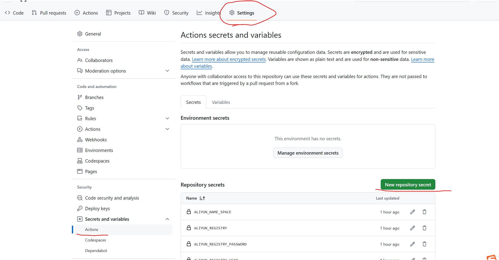
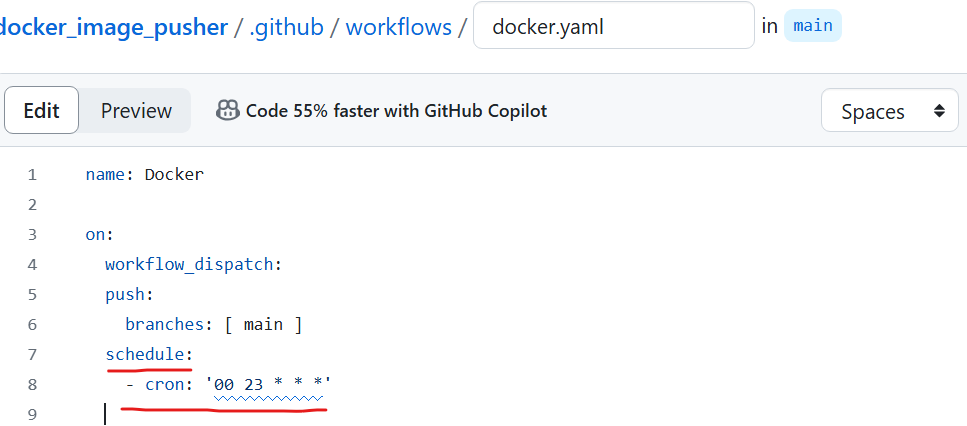

# Docker Build Pusher

使用Github Action将Dockerfile打包成docker镜像转存到阿里云私有仓库，供国内服务器使用，免费易用<br>
- 支持DockerHub, gcr.io, k8s.io, ghcr.io等任意仓库<br>
- 支持最大40GB的大型镜像<br>
- 使用阿里云的官方线路，速度快<br>


## 使用方式


### 配置阿里云
登录阿里云容器镜像服务<br>
https://cr.console.aliyun.com/<br>
启用个人实例，创建一个命名空间（**ALIYUN_REGISTRY_NAMESPACE**）


访问凭证–>获取环境变量<br>
用户名（**ALIYUN_REGISTRY_USER**)<br>
密码（**ALIYUN_REGISTRY_PASSWORD**)<br>
仓库地址（**ALIYUN_REGISTRY**）<br>


### Fork本项目
Fork本项目<br>
#### 启动Action
进入您自己的项目，点击Action，启用Github Action功能<br>
#### 配置环境变量
进入Settings->Secret and variables->Actions->New Repository secret

将上一步的**四个值**<br>
ALIYUN_REGISTRY_NAMESPACE,ALIYUN_REGISTRY_USER，ALIYUN_REGISTRY_PASSWORD，ALIYUN_REGISTRY<br>
配置成环境变量

### 添加镜像
当前目录新建一个文件夹，后续讲作为镜像的名字，里面放一个你已经写好的Dockerfile文件
### 构建镜像


### 使用镜像
回到阿里云，镜像仓库，点击任意镜像，可查看镜像状态。(可以改成公开，拉取镜像免登录)


在国内服务器pull镜像, 例如：<br>
```
docker pull registry.cn-hangzhou.aliyuncs.com/shrimp-images/alpine
```
registry.cn-hangzhou.aliyuncs.com 即 ALIYUN_REGISTRY(阿里云仓库地址)<br>
shrimp-images 即 ALIYUN_REGISTRY_NAMESPACE(阿里云命名空间)<br>
alpine 即 阿里云中显示的镜像名<br>


### 定时执行
修改/.github/workflows/docker.yaml文件
添加 schedule即可定时执行(此处cron使用UTC时区)

